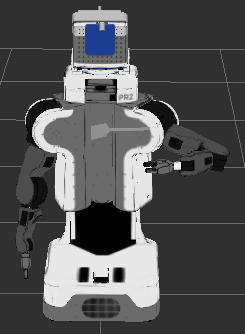

# Sherpa demo

For installation instructions see below plus iai_rescue_robots.

This demo will show the sherpa_box in rviz and you will be able to add and remove four 'wasps' to it.
 * roscore
 * roslaunch urdf_management_tutorial sherpa_box.launch
 * rosrun urdf_management_tutorial sherpa_box_add_wasps
 * rosrun urdf_management_tutorial sherpa_box_remove_wasps

To see the changing robot model in rviz you have to use the DynamicRobotModel instead of the RobotModel plugin.


# urdf_management tutorial


## Installation

Checkout the following repos into your workspace:
  * https://github.com/code-iai/iai_control_pkgs
  * https://github.com/code-iai/iai_common_msgs
  * https://github.com/ros/roslisp_common (only until a version with cl_urdf gets released)
  * https://github.com/cram-code/cram_3rdparty

Additional repos required only for this tutorial:
  * https://github.com/cram-code/cram_core
  * https://github.com/cram-code/cram_bridge
  * https://github.com/code-iai/iai_robots

Build all packages by running ```catkin_make```.


## Start-up
Start a roscore in a new terminal:
  * ```roscore```

Start controller for the joints and set the ```/robot_description``` parameter to the pr2.urdf in a new terminal:
  * ```roslaunch loopback_controller_manager_examples pr2_all_controllers_simulation_dynamic_state.launch```

Start the urdf management service in a new terminal:
  * ```roslaunch urdf_management urdf_management.launch```

Start rviz in a new terminal:
  * ```rosrun rviz rviz```

In rviz,
  * set the fixed frame to ```base_link```
  * add a plugin of type ```DynamicRobotModel```

You should see the PR2 in rviz like you would with the normal RobotModel:


## Adding and removing a link

If you are using ros indigo the spatula will currently not be displayed beause of an issue in rviz. See https://github.com/ros-visualization/rviz/issues/853.

To add a link type in a new terminal:
  * ```rosrun urdf_management_tutorial add_spatula.lisp```

In rviz you should now be able to see a spatula in the left gripper of the PR2.


We can now modify the properties of the spatula link and joint. To move the visual of the link upwards type:
* ```rosrun urdf_management_tutorial move_spatula.lisp```

 

To get the spatula back to its initial position we can simply add it again:
* ```rosrun urdf_management_tutorial add_spatula.lisp```

The spatula is now part of the robot description and connected to the left gripper via a fixed joint. To see the arm moving with the spatula in the gripper type:
  * ```rosrun urdf_management_tutorial move_arm.lisp```


After you added the spatula you can remove it again by typing:
  * ```rosrun urdf_management_tutorial remove_spatula.lisp```

You can also remove parts of the initial robot description. To remove the left gripper type:
 * ```rosrun urdf_management_tutorial remove_left_gripper.lisp```


## Using the simple interface

Add the description of the spatula to the parameter server using one of the two commands:
* ```rosparam set /urdf_management/spatula "<link name=\"spatula\"><visual><origin rpy=\"0 0 0 \" xyz=\"0 0 0\" /><geometry><mesh filename=\"package://urdf_management_tutorial/meshes/kitchen/hand-tools/edeka_spatula1.dae\" /></geometry></visual></link><joint name=\"joint_spatula\" type=\"fixed\"><parent link=\"l_gripper_r_finger_tip_link\" /><child link=\"spatula\" /><origin rpy=\"-1.57 0 0.5\" xyz=\"0.22 0 0\"/></joint>"```
* ```rosrun urdf_management_tutorial spatula_to_parameter_server.lisp```

Add the spatula to the robot description:
* ```rosservice call /urdf_management/simple_alter_urdf 1 "spatula"```

Remove the spatula from the robot description:
* ```rosservice call /urdf_management/simple_alter_urdf 2 "spatula"```

## Using the urdf file

Add the spatula to the robot description
* ```rosservice call /urdf_management/urdf_alter_urdf 1 "urdf_management_tutorial/urdfs/spatula.urdf" "<joint name=\"joint_spatula\" type=\"fixed\"><parent link=\"l_gripper_r_finger_tip_link\" /><child link=\"spatula\" /><origin rpy=\"-1.57 0 0.5\" xyz=\"0.22 0 0\"/></joint>" ""```

Remvove the spatula from the robot description
* ```rosservice call /urdf_management/urdf_alter_urdf 2 "urdf_management_tutorial/urdfs/spatula.urdf" "" ""```
